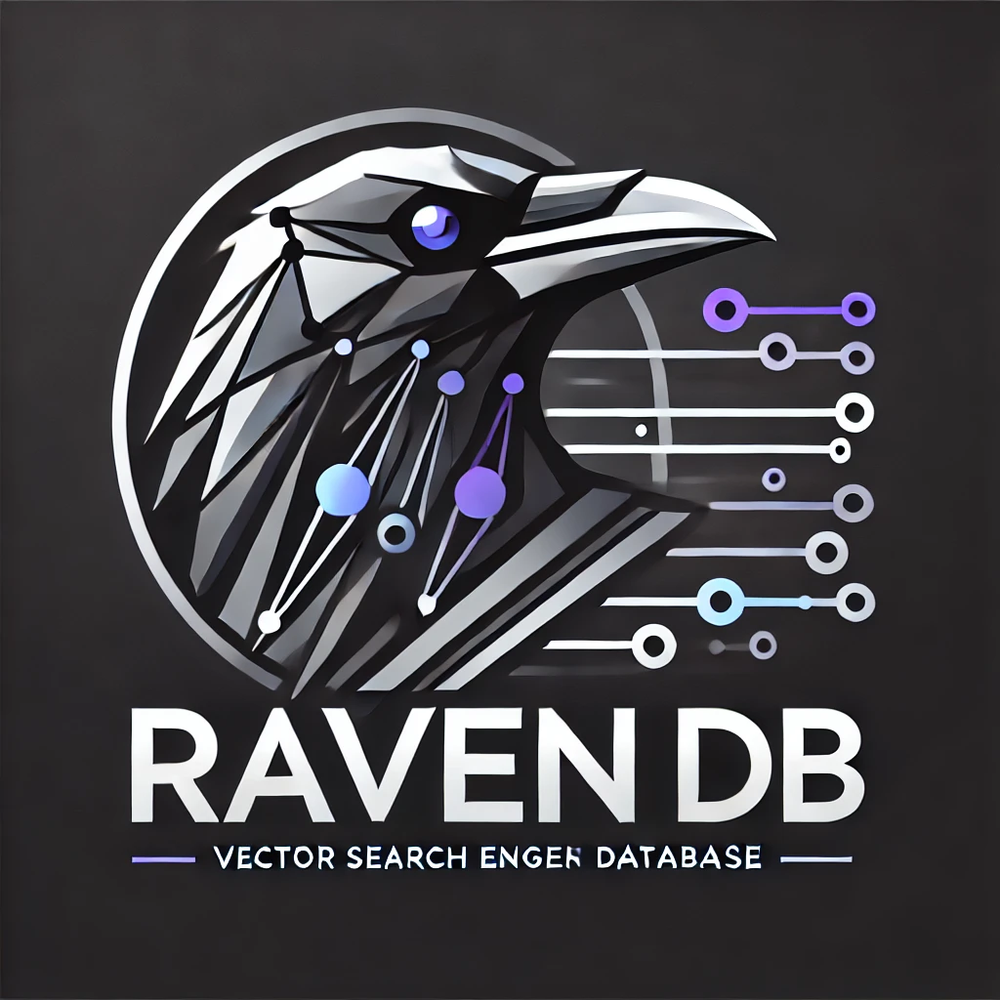

# Raven

Raven is a cloud-native search engine database.

## Implemented Features

* Indexing
    * Inverted Index
* Search
    * TF-IDF
    * BM25
* Natural Language Processing
    * Subword Tokenization
    * Stopword Removal
    * Language Detection

## Profiling and Tracing

Basically, this application uses `net/http/pprof` for profiling and tracing.

For visualizing the profiling and tracing, open `http://localhost:6060/debug/pprof/` in your browser.

## ToDos

* [x] Use bloomfilter for filtering the UNK tokens
* [ ] Make search engine to be able to load & save to/from file system
    * [ ] Build index from reading and parsing raw text files
    * [ ] Save and load index and bloom filters to file
    * [x] Add support for incremental indexing with flushing
* [ ] Enhance the FTS features
    * [ ] Build fuzzy full-text search by using SuffixTree
    * [ ] Levenshtein Distance Spell Correction
    * [ ] Pseudo Relevance Feedback
* [ ] Add support for vector index
    * [ ] HNSW
    * [ ] Flat

## References

- [blurfx/mini-search-engine](https://github.com/blurfx/mini-search-engine)
- [System Design for Discovery](https://eugeneyan.com/writing/system-design-for-discovery/)
- [🤗 bert-base-multilingual-cased](https://huggingface.co/bert-base-multilingual-cased)
- [sugarme/tokenizer](https://pkg.go.dev/github.com/sugarme/tokenizer)
